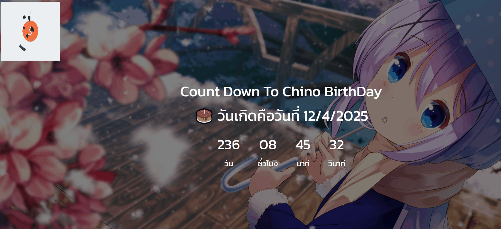

# 🎉 Birthday Countdown

A simple countdown timer to your next birthday, built with **HTML**, **CSS**, and **JavaScript**.

This countdown will dynamically calculate the remaining time until **December 4th** of this year — perfect for celebrating your special day! 🎂

---

## 📸 Preview

<p align="center">
  
</p>

> 💡 **Based on the preview image, you can customize the code for your own special day** such as an anniversary, New Year's Eve, or any meaningful event (this is just my fav character birthday).

---

## ⚙️ Features

- ⏳ Real-time countdown to your next birthday
- 📆 Automatically adjusts to the current year
- 🕒 Shows days, hours, minutes, and seconds
  
---

## 🧠 How It Works

The app calculates the difference between the **current date** and your **next birthday**, then breaks that down into months, days, hours, minutes, and seconds.

---

## 🚀 How to Run the Project

1. **Clone the repository** (Or just download with zip): 
   ```bash
   git clone https://github.com/Chinorin/Count-Down-BirthDay.git
   
2. cd birthday-countdown

3. Open index.html in any browser (just double-click the file or right-click > open with browser).

## ✏️ Customize Your Special Day
To set your own date, open the .js file and modify this line:
  ```bash
const birthdayTime = new Date(`December 04 ${currentYear} 00:00:00`);
```
For example, if your special day is Valentine’s Day (Feb 14), update it to:
  ```bash
const birthdayTime = new Date(`February 14 ${currentYear} 00:00:00`);
```


   
